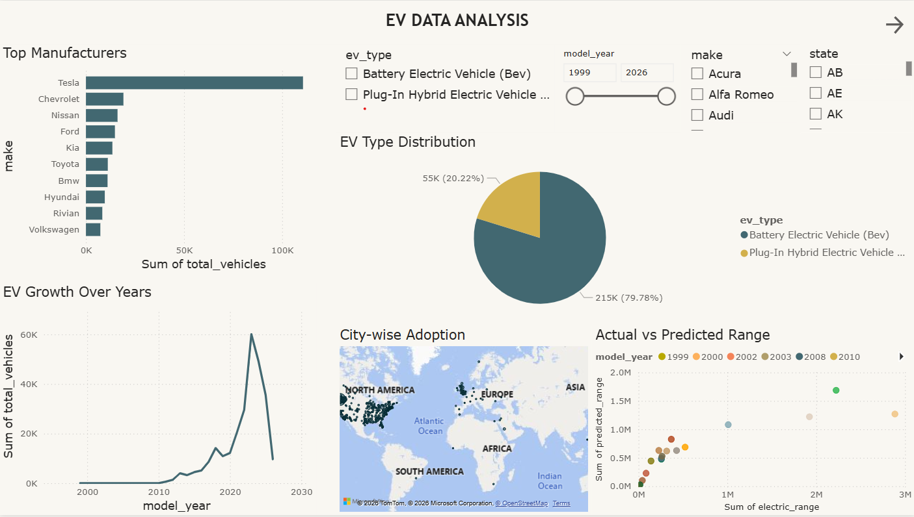

🚗 EV Data Analysis Dashboard

📌 Project Overview
This project presents an interactive **Electric Vehicle (EV) Data Analysis Dashboard** built using **PostgreSQL, Power BI, and Machine Learning**.  
The goal of the project is to analyze EV adoption trends, manufacturer performance, EV type distribution, geographic adoption patterns, and compare actual vs predicted EV ranges over time.

The dashboard enables users to explore EV data dynamically using slicers for **EV type, model year, manufacturer, and state**.

---

🧩 Key Features
- 📊 Top Manufacturers Analysis based on total EV registrations  
- 🔋 EV Type Distribution (BEV vs PHEV)  
- 📈 EV Growth Over Years to understand adoption trends  
- 🗺 City-wise EV Adoption Map for geographic insights  
- 🤖 Actual vs Predicted EV Range using a Machine Learning model  
- 🎛 Fully Interactive Slicers* affecting all visuals simultaneously  

---

🛠 Technologies Used
- PostgreSQL – Data storage, modeling, and SQL analysis  
- Power BI – Interactive dashboard and data visualization  
- Python – Machine learning model for EV range prediction  
- GitHub – Version control and project documentation  

---

🗂 Project Structure
EV-Data-Analysis/
│
├── PowerBI/
│ ├── EV_Data_Analysis.pbix
│ └── dashboard_screenshots/
│ └── final_dashboard.png
│
├── SQL/
│ ├── create_tables.sql
│ ├── views.sql
│ └── data_cleaning.sql
│
├── ML/
│ ├── ev_range_prediction.py
│ └── ev_model_training.ipynb
│
├── Dataset/
│ └── Electric_Vehicle_Population_Data.csv
│
└── README.md

▶ How to Use the Dashboard
1. Load the SQL scripts into PostgreSQL  
2. Open `EV_Analysis.pbix` in Power BI Desktop  
3. Update PostgreSQL database credentials  
4. Refresh the data  
5. Use slicers to explore insights dynamically  

📊 Dashboard Insights
- Tesla leads EV manufacturing by a significant margin  
- Battery Electric Vehicles (BEVs) dominate EV adoption  
- EV adoption has grown rapidly after 2015  
- Urban regions show higher EV penetration  
- Predicted EV range closely follows actual range trends  

🎓 Academic Relevance
This project demonstrates:
- Proper data modeling using SQL  
- Real-world BI dashboard design  
- Integration of ML predictions into analytics  
- Professional project versioning using GitHub  

👤 Author
Aron Shakha  
Final Year Project – EV Data Analysis